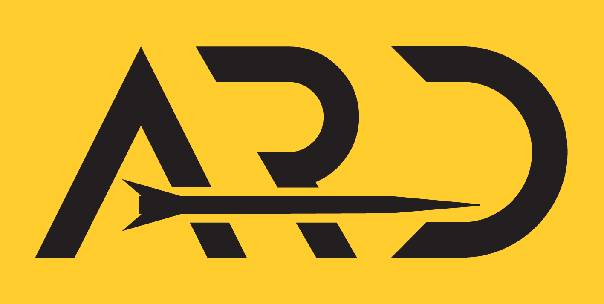

# Adept Rocketry Ground Station

<!--  -->


## Installation

### Flask Server
```bash
cd groundstation
rm -rf myenv
python3 -m venv myenv
source myenv/bin/activate
pip install -r requirements.txt
cd ..
```

### Frontend

```bash
cd groundstation_ui
npm install
cd ..
```

### Run the groundstation server

```make run_groundstation```

### Run the groundstation ui

```make run_groundstation_ui```

## Planned Features

- [ ] Teensy System Integration
- [ ] Add table
- [ ] Graphs page
- [ ] Export flight data to CSV
- [ ] More robust disconnect mechanism (disconnect regardless of connection failure)
- [ ] Clean up code and add hooks to seperate custom hook
- [ ] Database to save past flights
- [ ] Simulation Mode
- [ ] Concurrent guis through a distributed system

## Other

Free port 
lsof -i :5001