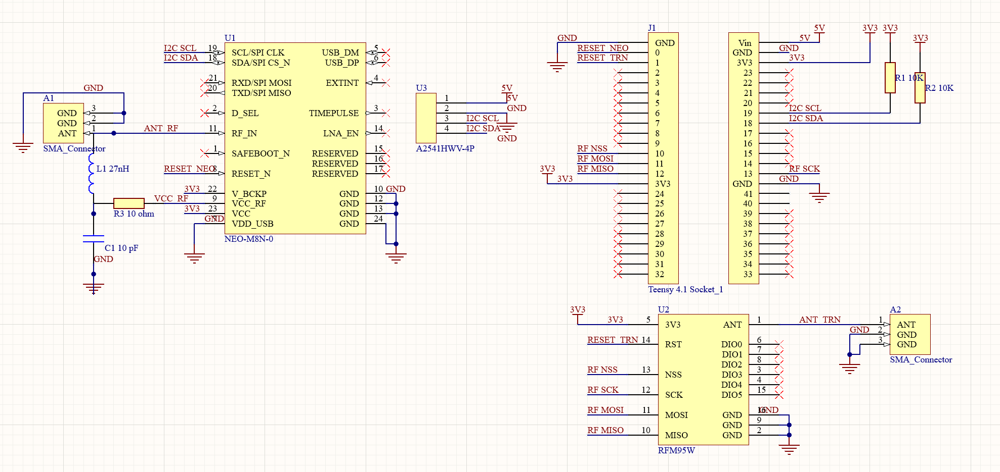

# Groundstation Embedded System


## Hardware

- Teensy 4.1
- LoRa Module

## Groundstation circuit schematic



## GroundStation Libraries

- RadioHead
- LiquidCrystal I2C (Frank de Brabander)

## Binary packet structure

```C
struct TelemetryPacket {
  uint32_t time;                   // 4 bytes
  float altitude;                  // 4 bytes
  float bmpTemp;                   // 4 bytes
  float imuTemp;                   // 4 bytes
  float pressure;                  // 4 bytes
  float accX, accY, accZ;          // 12 bytes
  float angVelX, angVelY, angVelZ; // 12 bytes
} __attribute__((packed));         // Ensure no padding in the structure
```

Alternatively the data can be read from CSV files through a serial stream. This approach is more human readable

Refer to [Telemetry.hpp](/embedded/core/Telemetry.hpp) for packet structure and shared utility functions